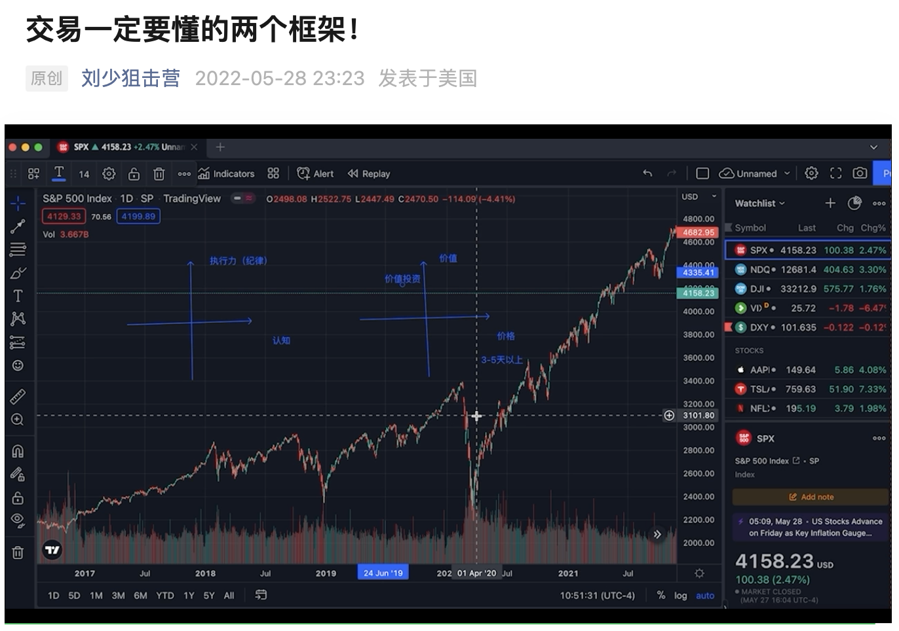

[视频链接](https://mp.weixin.qq.com/s/BRi52TLyrCkvvKmjcns3Bg)

## 两个错误的观点

* 1. 买入一只股票一直放着，一定能赚钱。
* 2. 网上看的观点或者研报，跟着买入，一定能赚钱。

## 原因

> 1. 认知不够，没有差异化，识字的小孩也能做。
> 2. 利润看在三四天之后，与赌博无异。

利润来源于**认知差**，二八原则。

**1类人**是韭菜，给**2类人**提供信息的事镰刀。

## **认知与执行力框架**

* 1. 认知高、执行力强：大牛
* 2. 认知高、执行力弱：分析师、爱因斯坦等
* 3. 认知低、执行力高：机器人、程序、策略
* 4. 第四象限：无限潜力

## **价格与价值框架**

* 1. 价值高、价格高：蓝筹，茅台、facebook、腾讯、阿里，对老手来说，价格下跌，与价值背离的时候就是买点。
* 2. 价值低、价格高：炒作股，什么样的标的在什么样的行情和情绪中上行（短线精髓），长持达到3-5天以上一般会很惨，只适合做短线套利。
* 3. 价值高、价格低：价值投资，巴菲特，如光伏的中环、爱旭，一般来说周期会长。
* 4. 价值低、价格低：垃圾股，不要碰。

**已经price in的股票，站岗，韭菜的经典行为。**