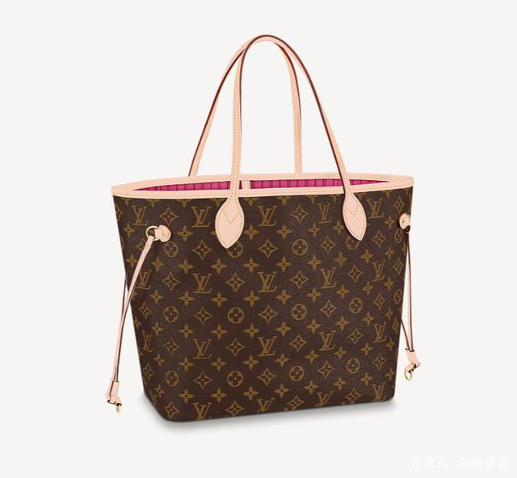
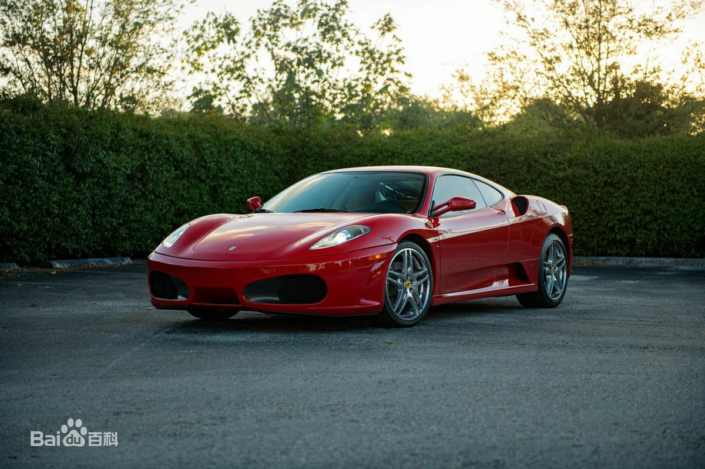

# 2022-06-11-女人的包与男人的车

交易连续亏损，快要崩盘，打算停手，专心复盘，总结问题，做自救计划。

自救计划还没开始写，突然想起**包与车**的话题，遂询问妻子对于奢侈品包的看法。

也正是从这个话题切入[十年人生复盘](2022-06-11-十年人生复盘.md)。

## 奢侈品包

奢侈品包对于99%的女性而言都是有吸引力的，区别在于每个人的**着迷程度**和**理智程度**。

上图是我给妻子买的人生第一个奢侈品包，大概是2017年，价位在六七千，

同事的朋友帮忙从意大利捎回来的，特别感谢同事和她的朋友给妻子带来的惊喜。

截至写这篇笔记，一共就买了两个包，另一个还是LV，价位在3w以内，1.x还是2.x我是记不清的。

她对于奢侈品包的看法，主要有以下几点：

#### 实用为主

第一个LV包实用与美观兼顾，对于初到北京的我们来说，已经很让人开心了。

#### 与经济能力匹配

妻子表示她也喜欢香奈儿、爱马仕，但目前的经济能力不足以支撑，不会失智剁手。

一个七八万的爱马仕，配货两倍，最后成本可能20多w，妻子表示太不值了。

与经济能力不匹配的奢侈品包，即使勉强入手，别人也不会认为你背的是真包。

当经济能力足以支撑自己的喜好，她也会很开心的去拥有自己心仪的新包，此时的不值在经济能力面前已不必计较。

我们在奢侈品包这个话题上，没有过很大的分歧，我的想法与行动一直保持着：

> happy wife happy life as soon as I can afford.

我做过一些超前的允诺，比如婚礼及重要节日各一个包，平均每年额外一个包，

其实至今一共也就买过2个包，总价不超过3w，妻子从来没有在这个点上揪我小辫子。

## 豪华车

**其实想想，男人的车与女人的包，在逻辑上并无二致。**

#### (1)年幼时期

我本身从小就喜欢车，比较完整的记忆是从父亲的最后一台**一汽解放红塔微卡**开始的。

再早的赣江翻斗车、蓝色龙马车，已经没有太多印象。

小时候总想跟着父亲的车出门，但是不能如愿，但是有一次例外让我印象深刻：

父亲在桥头碰见我和小伙伴，就把我们捎带出去坐车了，小时候能坐车是一件很让人欢喜的事，

经过盘山路，中途叫**戴刚**的小伙伴晕车吐了，吐在父亲的小本本上，后来他自己初入社会时也随他父亲成为了一名司机。

#### (2)青少年时期

初中让人兴奋的是动画片**头文字D**、

舅舅的摩托车可以用其他的钥匙在某个角度开锁、

F1车王舒马赫的辉煌时期、凌晨偷父亲的车钥匙和兄弟们出去兜风。

**回来停车位置不对，父亲摸过发动机有余热，但是没有找我谈话。**

#### (3)大学

憧憬着步入社会，赚钱买一台属于自己的车。

#### (4)步入社会

母亲一再告诫**要先存钱买房，不要先买车。**

这与我的内心相悖，导致我后续的内耗逐渐加大。

回过头去看，如果我在有能力购买属于自己的第一台车的时候，

跟随了内心深处的想法去拥有了，后续的人生轨迹会怎样？

时至今日已无法后悔，只能往前看。

小儿子自幼表现出对汽车的浓厚兴趣，想来我会给他的人生建议是：

**去追求自己发自肺腑的喜欢，人生需要正反馈。**

#### (5)被社会毒打

有了代步的轩逸之后，我还是想拥有一辆自己喜欢的车，比如奔驰、宝马等。

也因为这个想法，一再被社会毒打，**在欲望与能力不对等的时候**。

## 包与车

目前我们的车是日产轩逸纯电，夫妻二人，两个孩子，日常通勤性价比无敌。

轩逸是一个普通地摊包，完全能满足日常使用，而且使用成本低，无需操心养护。

宝马5系、奥迪A6L、奔驰E级，就是入门的LV，努把力也能够得上。

宝马M、奥迪RS、奔驰AMG，则是爱马仕，经济能力允许的时候，我也会完成我的执念，即便他们确实性价比不高。

法拉利，则是巅峰，是自由的代名词，是一生的向往。