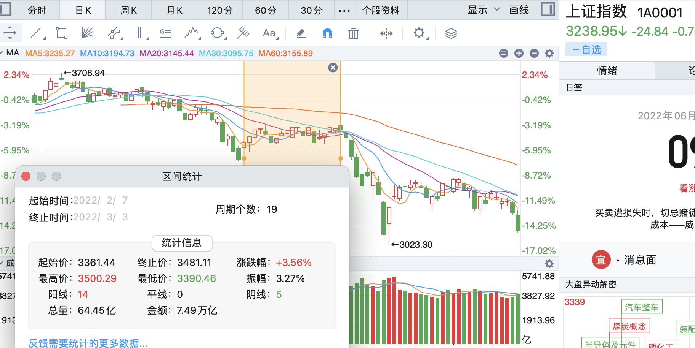
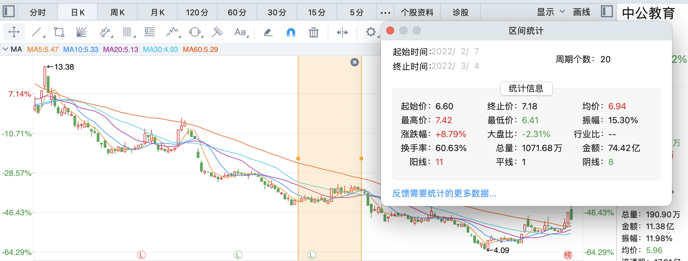

# 2022-06-09-中公教育的观察

最早关注中公教育是在2021年11月，大概9块出头，知乎上偶然看到一个问题，大概是如何看待中公教育这只股票。

有一个回答说了好几种可能，只记得**如果主力xx，那这只票就值钱了**。

半年过去，跌到了4块多，和我的股票账户一样腰斩。

## 昨日观察

## 仔细回溯

今日又细细回溯了近期走势，在**k线、成交量、分时走势、竞价**几个方面发现了一些有意思的点。

#### k线

> 曾经辉煌：区间统计，30个月，2年半，11倍的涨幅，也算是大牛股了。

> 反抗失败：春节后第一个交易日2022年2月7日至3月4日，大盘指数处于平台期，个股尝试突破平台，随后大盘暴跌，突破失败。

> 筑底：4月26日走出来的市场底，27日指数大反弹，28日个股最后一击杀跌，29日涨停。

> 平台突破**：6月8日算是2021-02-02的w顶之后一路暴跌的第一次平台突破。

#### 历次涨停成交量&竞价

每一次平台期都有涨停大阳线，伴随着**放量**。只有指数触底2863之后，才突破成功。

> 2021-04-29 13:26上板，回封，较前一日4倍放量。

> 2021-09-09 13:39上板，回封，温和放量。**当日竞价下杀，次日竞价拉升，高开低走，为箱体上沿。**

> 2021-10-14 10:14上板，回封，温和放量。**当日竞价下杀，次日竞价下杀，低开低走，为箱体上沿。**

> 2021-12-09 13:10上板，回封，较前一日4倍放量。**当日竞价平，次日竞价下杀，平开冲高回落，为箱体上沿。**

> 2022-02-21 10:05封板，较前一日4倍放量。**当日竞价平，次日竞价下杀，平开低走，为箱体上沿。**

> 2022-04-29 10:20封板，未放量。**当日竞价盘前拉升至零轴，次日竞价下杀，平开收涨，进入横盘期。**

> 2022-05-18 10:11封板，微增量。**当日竞价盘前拉至水上微微高开，突破横盘。**

> 2022-05-19 09:52封板，2倍量。**当日竞价下杀，高开3%，连板，次日竞价下杀，高开4.64%，高开低走，为箱体上沿。**

> 2022-05-27 13:01上板，炸板，3倍量。**当日竞价平，高开3%，连板，次日竞价下杀低开，收长十字星，为箱体上沿。**

> 2022-06-07 13:01上板，炸板，3倍量。**当日竞价平。**

> 2022-06-08 10:26上板，回封，微增量。**当日竞价平，突破箱体。次日竞价下杀，高开低走。**

**3月15日之后的平台期开始就没什么割肉盘了，5月初主力横盘开始收集筹码，6月8日第一次突破平台。**

# 结论

5月初开始**筑底成功**的概率比较大。

疫情+协议班业绩雷，**利空基本消化**，已反应在股价上，已经不能再差了，**向上空间很大**。

问题是**横盘横多久**，或者**直接启动**？时间成本几何？

