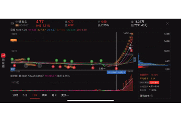
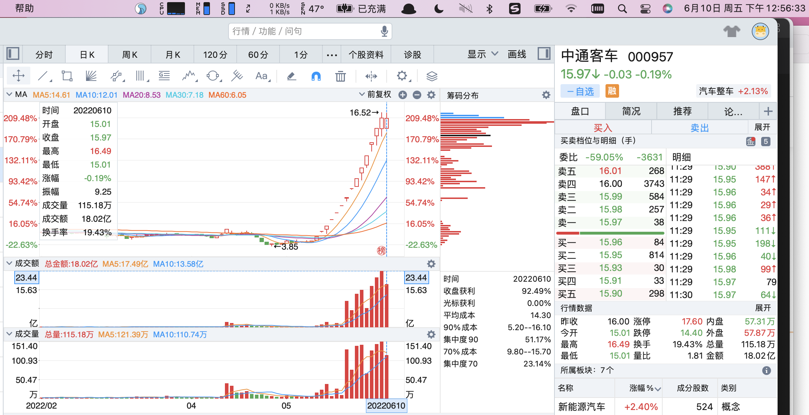
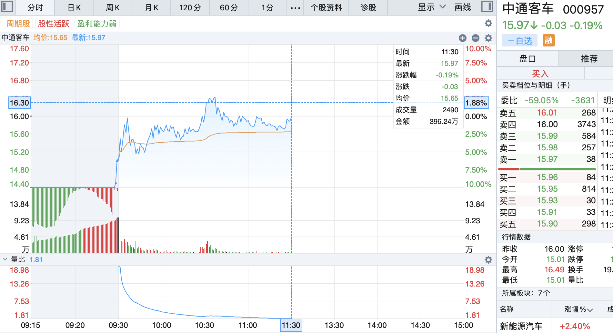
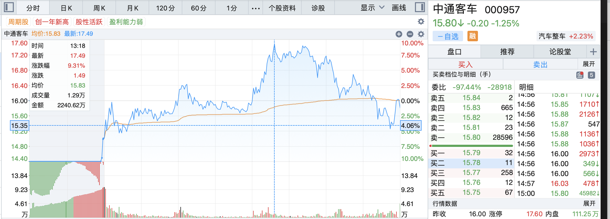

# 2022-06-10-中通客车总结

## 买入

向来是不敢碰高标股，之前的九安医疗、龙津药业等，

认知之外，不知道为啥能涨成这样，就看着他们涨。

```
或者说中通的12板 打开了高度？

J:是的 高度打开了 而且是不断接力上去的 还有一点很重要 它没什么后排跟风 属于独立逻辑 上一个有独立逻辑的是业绩线的九安医疗 这次啥逻辑都没有 就是市场情绪强 这种就是真正的妖 和去年的顺控发展一样

明白了刘少，那还有个问题就是 这种妖情绪的预期在哪 该怎么去思考？

J:就是连板高度 现在是13 后面的高度起码也是10以上

J:接到一个七八板的就是50个点利润 大概是这样的情况
```

这次仅仅是因为刘少的个人看法，忐忑地买入了。

**其实自己还是在赌**，没有自己真正的买入逻辑。

内心不相信蹭个15分钟核酸检测圈的热点，少量核酸检测车的订单就能支撑10多个连板继续往上走。

## 停牌

第二天加仓未上板，紧接着停牌。（尾盘连偷袭都没有，断板了应该把前日的筹码T出去的。）

停牌一周，复牌前一天的复盘计划都没想清楚明天复牌该怎么办。

心里隐约有个想法：即使到头了，也会冲高给个跑路的机会，不能开盘就核按钮。

> 买入逻辑已经没有了，即使是别人的逻辑：

中通到这个高度，是被汽车主线趋势推上去的，主线已退潮，龙头也要倒下。

大都市15分钟核酸检测圈+核酸检测车的利好，顶多能支撑7~8个板。

## 卖出

复牌当天竞价跌停，盘前拉到-6%，等待最后的诱多冲高，也如预期，没有迅速下杀。

这里的逻辑，**事后**个人理解为：大资金也没跑完，停牌、复牌这种环境，可以低开，但是**开盘必须拉**。

开盘一旦下杀，**情绪会被带崩**，天量筹码按下核按钮，没人能接得住，

接着就是连续的一字跌停，谁也跑不了，所以大资金开盘必须拉住，不能下杀。

午盘休盘，翻看日k筹码峰：



时下的日k形态，让我联想到一个**头肩顶**的概念，



加上**亏怕了，只想着保住现有利润**，在午盘前对着买单挂单砸出。



紧接着就是拍大腿环节，收盘重新翻绿，心情能好点，至少没亏损更多。



## 总结

赌了一把，侥幸小赢了一次。

**没有自己的买入逻辑**，会让人睡不着觉：又想接七八个连板，又怕全仓跌停大亏。

做得好的地方：**及时调整预期**，保住本金，保住已有利润。
