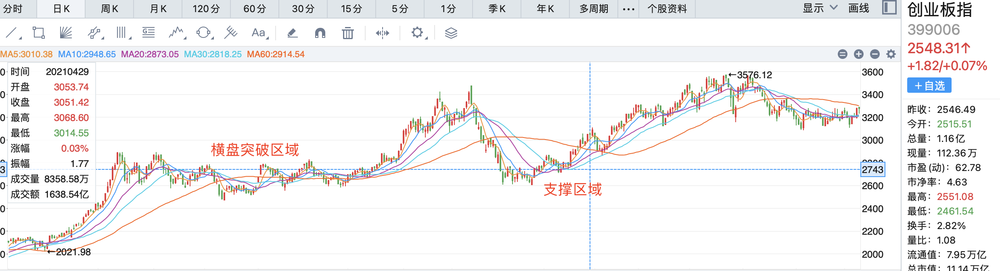
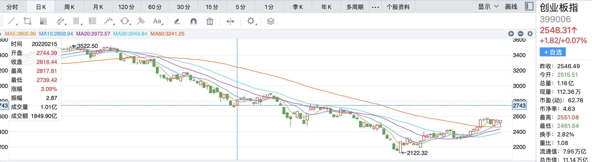

# 2022-06-14-2月15日创业板指的重仓逻辑





```
还有个疑问，2月15日早盘重仓创业板指的逻辑，我理解的几个逻辑是：
1. 当天开盘点位2744，为前期横盘突破点位，和突破后回踩的支撑点位。

2. 前日的反弹信号，上影线高点达到前一日阴线实体的一半，收阳。

3. 当日的高开信号。

这3个逻辑应该包含在您当时的交易逻辑里吧？此外还有别的比较重要的逻辑吗？
```

> Joe: 是的 比较重要的就是当时的宏观环境了 资金面上的没有了
