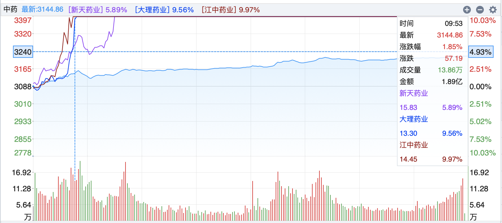
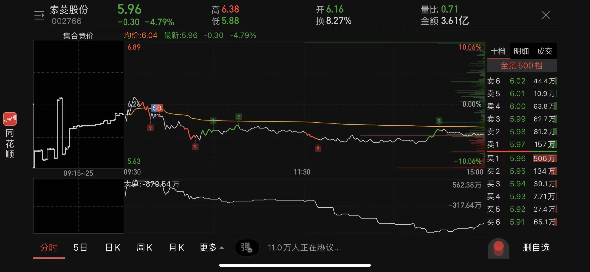
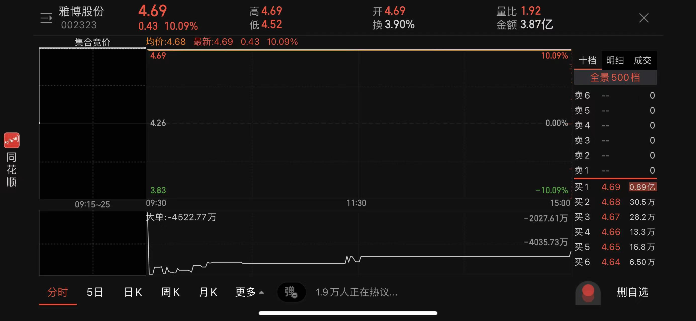
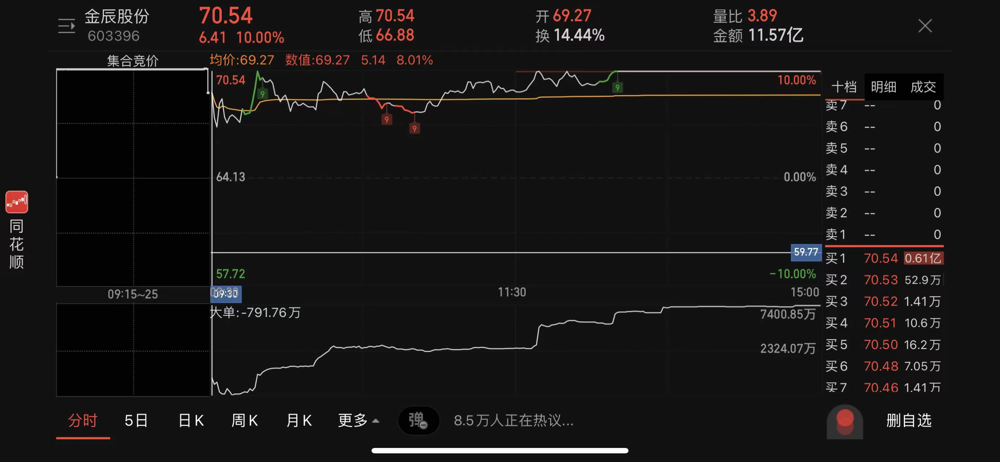
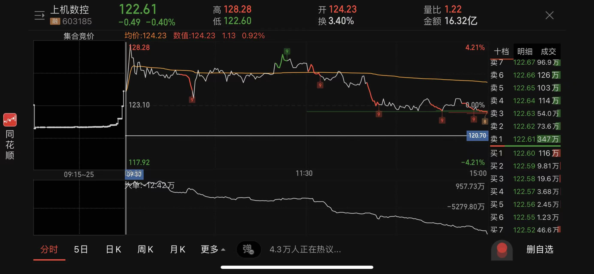
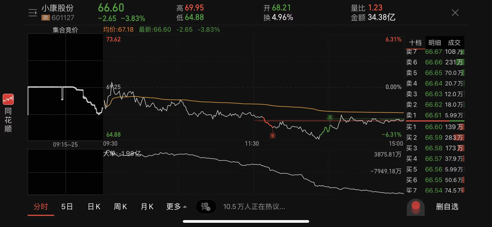

## 大盘

指数调整迟迟未到

**板块在轮动**：早盘**HJT电池**涨幅第一，尾盘前四涨幅为**中药、青蒿素、新冠治疗**。

**中药板块**：由**江中药业、大理药业、新天药业**带动，按上板时间排序，。

> 江中药业：获利盘比例大，成交量太大，以往这个成交量都不是好事。

> 大理药业：获利盘37.85%，股性活跃，多连板，可以重点观察。

**青蒿素板块**：个人认为是跟风，样本量少，涨幅才排第二，个股分时走势都不强。

**新冠治疗**：走势强劲的是**大理药业、新天药业**。

> 新天药业：箱体上沿，上方60日线待突破，价格相对低位，收盘获利77.09%。

## 昨日反馈

> 索菱股份

负反馈，低开，已出。

## 当日操作

> 索菱股份

**卖点错误**：开盘不及预期，按纪律应尽快止损。本有机会在水上止损，又拖到水下，不及格。

当时正在盯分时，汽车零部件板块越走越弱，按纪律应该迅速止损，此时还有机会在5%左右进昨日的观察目标**金辰股份**。

纪律之外，次一些的选择是最高点下来反弹后高点再次下杀时卖出，所谓一高不及一高，越走越弱。今日是运气好，否则在成交点那儿直接下杀，又是一番代价。

**为什么等水上清仓**：竞价时段有所拉升，所以产生拉升上水这个预期。

> 爱旭股份

**买点错误**：计划外标的，完全违反纪律。

## 昨日目标走势

> 雅博股份：一字板

> 金辰股份：高开8%

> 上机数控：高开拉升，昨日已有调整预期，竞价也不如金辰股份，逻辑上应金辰股份优先。

> 小康股份：低开，昨日因为成交量原因已排除掉。

## 当日错失机会

> 上海能源：煤炭的板块指数也是有一个简单的见顶信号 目前来看上涨乏力 如果做长线的话我不是太了解这家公司 至少趋势有些停滞 如果是我的话会考虑卖出

> 金辰股份：索菱股份及时止损，还有机会在5个多点进，此处仓控也是个问题，倘若有空闲仓位，也不至于被动。

## 当日观点

> 爱旭加仓：如果是我我都不太敢加了，最近涨成这样也是出乎我意料的 时间点不太对 具体原因没找到很根本的逻辑

> 光伏基本面是一直很好 这个没有变过 关税的事再升了一个档次 爱旭是独立逻辑强 abc电池的前瞻性和对整个发电效率的提升

> 科创有支天合光能基本面不错 但不适合短线 适合长拿

> 之前做过的海兰信有利好订单

> 金辰：金辰难度很大了

> 东风汽车：连板能在这里企稳后突破可以作为一个买点

> 618消费做一波短线？这个跟随市场 不需要做预判 等市场走出来了再关注

> A股里短线一定不要预判 我也经常犯这个错误 没有一次不是残局离场

> 中药是否一日游？今天的医药就是题材股的一个资金外溢；中药股实在话没有什么机构会做的 还是炒作的多一些 短线一日游偏多

## 明日预期

短线周期昨日已结束，趋势今日也调整了，**爱旭减仓**。

**目标**

> 暂时空仓吧

## 短线纪律：

> **认真复盘选股**

> **及时止损认错** ❎

不及预期迅速止损，避免错失其他机会。

> **不看计划外标的** ❎

计划你的交易，交易你的计划。

> **只拿隔日**

开盘快速拉升上板可以继续留，不板止盈，炸板止盈。