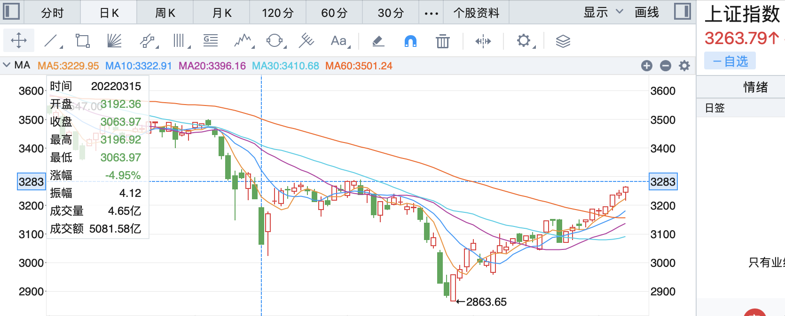
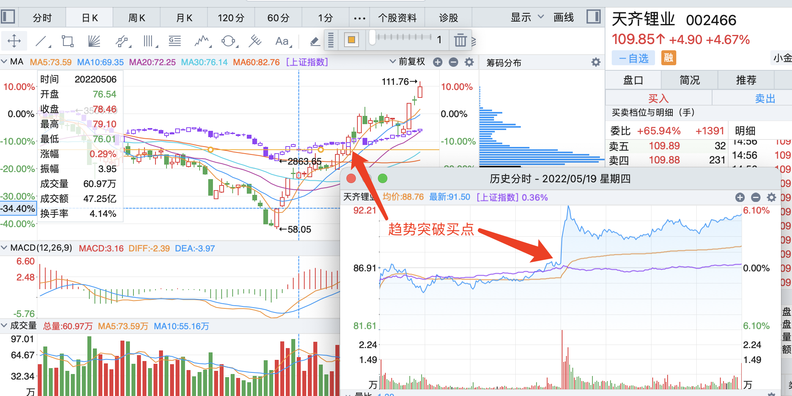
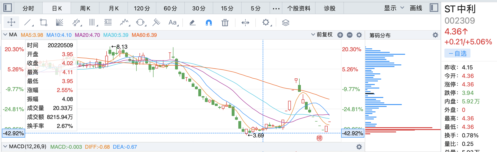
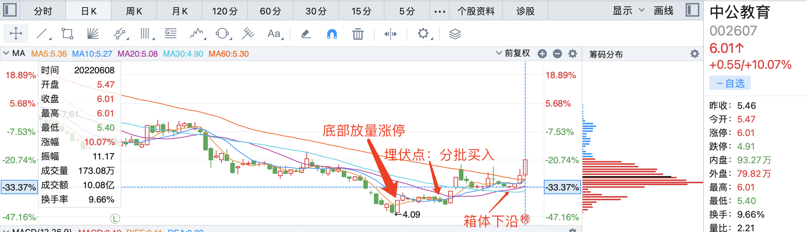

## 指数

指数等调整，刘少大呼看不懂。

在往上20点就是箱体上沿了

## 昨日反馈

> 爱旭股份

分时上冲很猛，买在一个高点，收盘浮亏。

## 当日操作

> 爱旭股份

竞价下杀低开，竞价直接出。昨日买入就是计划外，刘少观点是涨太快，建议回调入手或加仓，竞价心态就不行了。

> 上机数控

买入4笔：第一次触碰日均线失败后1笔124，第二次反弹再加1笔124，均线123.50加1笔，123.31再加1笔。

**买点错误**：虽然是高开，但是下杀，此处买之前就没决定好是短线还是长线，心理是期望长线的风偏+短线的收益，做梦。

## 当日错失机会

无

大理药业看盘不强，新天药业开盘强(还好没追)，中药板块走弱，个股也跟着弱。大理药业后面上板不在模式内。

## 当日观点

> 618有一支南极电商 图形好看 就看有没有风，几次放量都是分时直线拉升 明显是大资金主力手笔

> 海兰信：如果是我 回本之后拉升我还会加 目前亏两个点，之后再跌回成本再把今天的仓位t出去，我大概是这么个思路

## 明日预期

指数等调整，短线题材是超临界发电，没看到什么好的标的。只能从其他题材和以前看过的股中找。

**目标**

> 西仪股份：昨日的断板股，之前3连板，换手率不错，筹码也可以。同板块青岛双星连续2个地天板打出气势。

> 中公教育：看连板

## 一些观察

* 天齐锂业

5月5日卖点完全错误，收十字星卖出，本质上是**逃顶心态**，和**抄底**一样难。

5月6日大盘低开低走，天齐低开收红，表明强于大盘，次日依旧收小阳线站稳。

5月19日突破前期平台后，盘中上水时也是买点。

6月6日走势强劲，突破前期压力位，第一次封板前也是买点，当短线做可以博弈第二天溢价。

* 中利集团

看美盛文化是否有同样的机会

* 中公教育

马后炮我就是世界首富！

* 通策医疗

4月27日的买点也不算太差，虽然没等到**白白胖胖**最低量预判的新低。

有了3月16日之后的箱体经验，这个卖点简直是**无脑**，卖之前还用天齐锂业的钱补了仓。

## 短线纪律：

> **认真复盘选股**

> **浮盈加仓，浮亏绝不补仓**❎

> **及时止损认错**

> **不看计划外标的**

计划你的交易，交易你的计划。

> **只拿隔日**

开盘快速拉升上板可以继续留，不板止盈，炸板止盈。