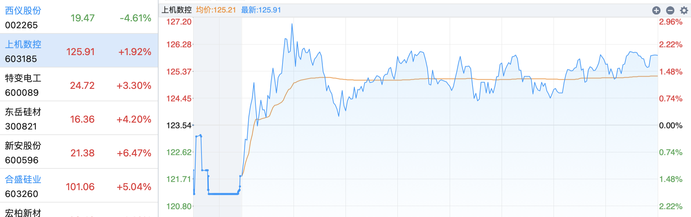
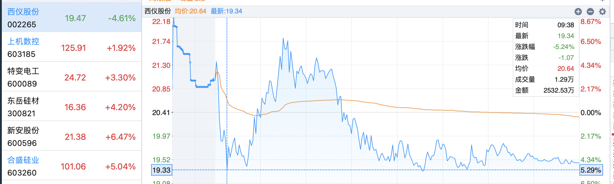

## 指数

指数终于调整，以能源为主，有机硅、磷化工也不错，板块涨跌情况：

前六：油气开采及服务、贵金属、石油加工贸易、煤炭开采加工、银行、证券。

后六：汽车整车、酒店及餐饮、汽车零部件、半导体及元件、景点及旅游、教育。

**超临界发电**题材熄火，龙头**华西能源**顶一字，江苏国信一进二。

**特力A**倒下，**宏润建设**上涨。。

合盛硅业上涨，同板块的**新安股份**炸板。

## 昨日反馈

> 上机数控微亏。

## 当日操作

> 上机数控

竞价低开亏损出，着急换高开的西仪股份。竞价阶段其实算拉升的。

> 西仪股份

昨日涨停，竞价高开，买1价全仓入。竞价阶段其实是下杀的。

## 当日错失机会

当日是犯错的，上机数控也是走趋势，西仪股份其实欲望并不强，竞价阶段还是鬼使神差改了主意。

**大幅亏损后心态真的不行，着急换股尽快赚钱，必须稳手。**

## 当日观点

> 反脆弱模型相关

> 仓控相关

## 明日预期

指数不懂了，中通客车复牌，刘少预期是还能蹦跶一会儿。

西仪股份和上机数控在图形上差不多，都是趋势突破，暂时先持有吧，避免来回挨打，不做T。

**目标（反脆弱模型）**

> 中通客车：

> 中公教育：仅观察

> 新安股份：仅观察

## 一些思考

反脆弱模型

## 短线纪律：

> **认真复盘选股**

> **浮盈加仓，浮亏绝不补仓**

> **开盘拉升买入，竞价不买**❎

> **及时止损认错**

> **不看计划外标的**

计划你的交易，交易你的计划。

> **只拿隔日**

开盘快速拉升上板可以继续留，不板止盈，炸板止盈。