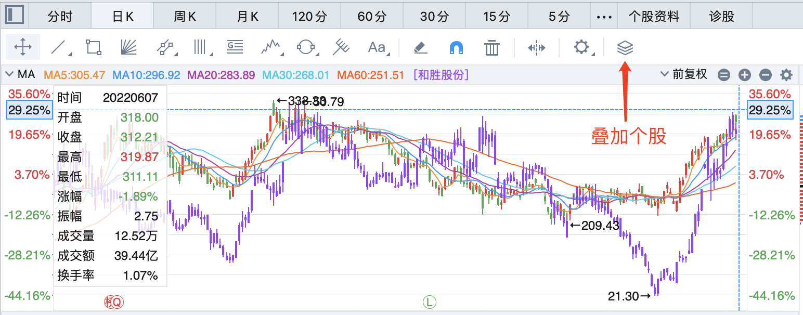

## 指数

调整迟迟未到

## 昨日反馈

> 宝塔实业

挂了3笔：开盘卖1价、7.5%网格、5%网格；成交2比。

**买点错误**：6月2日高标**中通客车**已停牌，**宝塔实业**和**特力A**作为后排，是风险大于收益。

## 当日操作

> 宝塔实业

**卖点错误**：作为高度股，竞价一直没到水面，已经说明问题了，开盘-2.66%，还抱有反包的幻想，结果割在地板上。**海南高速**吃过亏。

正确操作：竞价与预期相差甚远，9:25之前跌停价直接割。

> 索菱股份

买入2笔：开盘价6.80(-2.16%)买1/3仓，随后随意定了个6.66挂了剩下的2/3仓。

**仓控**：

**买点错误**：低开，不是右侧交易，违反拉升买入纪律。

## 当日错失机会

无

## 当日观点

> 和胜和比亚迪走势相关性极高 比亚迪有见顶风险 和胜同 对我来说是一个卖点

> 上海能源横盘时间过长 也是有利润可以撤退 已过五日线

> 爱旭已过前高 还会更高

> 做趋势要避回调 回调过后再入 长线都无所谓

> 比亚迪见顶如何判断？接近前高 至少我现在不认为可以破

> 爱旭还是等回调比较好 稳妥的就是中环

> 今日进小康逻辑？一个是华为汽车 这是个大题材 一个是小康属于趋势里面特别强的品种 一旦有强度不会那么快结束 我当作短线来做 并不是做趋势

> 小康明日是否还能再进？不建议了 今天量有点大 明天我也会撤 几个点利润即可

> 现在的中概就很有性价比 美股还是摇摇欲坠 还得再等

## 明日预期

宝塔实业、特力A均跌停，短线分歧。关注光伏赛道。

>索菱股份：下杀无脑卖，有机会水上卖。

**目标**

> 小康股份：今日量太大，明日不建议入，放弃。

> 雅博股份：刘少临盘买入的计划外标的，摘帽光伏，筹码结构好，低位。

> 金辰股份：去年的牛股，相对低位，筹码结构有瑕疵（收盘获利77%），上方距半年线81元还有10%的空间。

> 上机数控：研报提到的6月金股，均线多头，上方年线还有10%的空间。**五连阳，以往走势看可能要调整。**

## 短线纪律：

> **认真复盘选股**

> **及时止损认错**

> **不看计划外标的**

计划你的交易，交易你的计划。

> **只拿隔日**

开盘快速拉升上板可以继续留，不板止盈，炸板止盈。